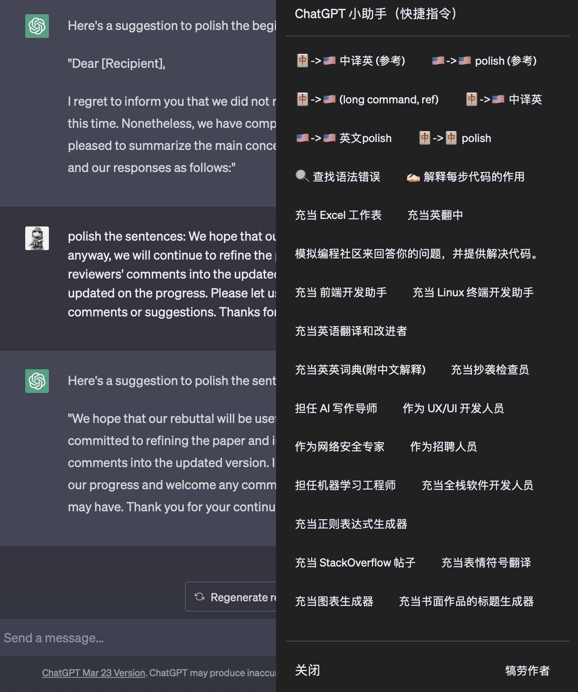
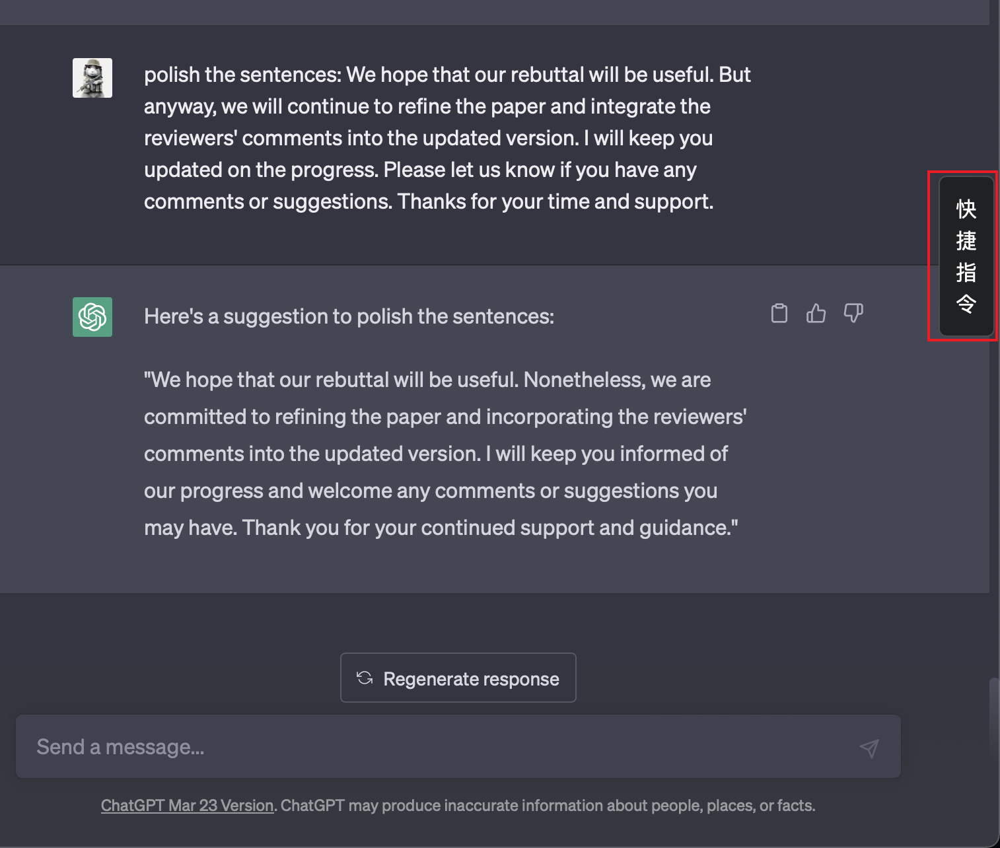

# Chatgpt Academic Helper: ChatGPT Asisten Akademik (ChatGPT Academic Prompt Helper) Bahasa Indonesia

Proyek ini adalah skrip Tampermonkey, yang dirancang untuk memfasilitasi input cepat **versi web** Chatgpt, dan memiliki beberapa templat cepat akademik yang umum digunakan di dalamnya.

Proyek ini didasarkan pada [ChatGPT 插件脚本](https://github.com/winchesHe/chatGPT-prompt-scripts)Modifikasi proyek, terutama untuk penggunaan pribadi. Diantaranya, akademisi Prompt Kontennya terus berlanjut [ChatGPT akademik](https://github.com/binary-husky/chatgpt_academic)proyek.

<!--  -->

## Install:

### metode 1：

去 Greasy Fork 安装脚本: [Install on GreasyFork](https://greasyfork.org/zh-CN/scripts/464480-chatgpt-academic-prompt-helper)

### metode 2：

将 `chatgpt_academic_helper.js` 文件下载下来，并拖入油猴脚本插件即可。

或手动新建油猴脚本 并粘贴 `chatgpt_academic_helper.js` 的内容。

## Usage:

### Membuka prompt panel:

<!--  -->

单击侧边栏的 “快捷指令” 按钮，或者用快捷键 `command+shift+F` (Windows 用户使用 `ctrl+shift+F`)。

### 输入 prompt:

单击想要输入的 prompt 即可。prompt 会添加在输入框之前。

### 关闭 prompt 面板:

使用快捷键 `command+shift+F`, 或是按下 `ESC` 按键即可。或点击界面的任意位置即可关闭。

### 自定义 prompt:

自行修改 `chatgpt_academic_helper.js` 文件中的内容即可。

## 赞助:

Jika menurut Anda skrip ini berguna, Anda dapat membelikan penulis secangkir kopi:：

